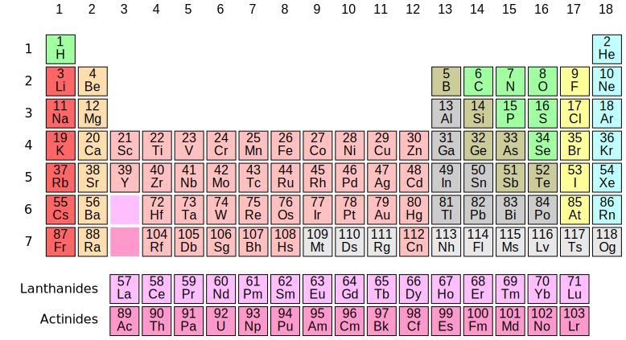

# Gipaw (and other) pseudopotentials
This repo collects some pseudopotentials I've generated for Quantum ESPRESSO and QE-GIPAW.
Most of them are norm-conserving pseudos are require a very high plane wave cutoff.

*Important: always test them on simple systems before doing any serious calculation!*

File name breakdown:
* pz, blyp, pw91, pbe: XC functional
* tm: norm-conserving, Martins Trouillier method
* rrkj: norm-conseriving, RRKJ method
*  rrkjus: ultrasoft, RRJK method
* paw: PAW
* gipaw: with GIPAW reconstruction
* semi: with semicore orbitals
* nh: generated with Nathalie Holzwarth's atompaw
